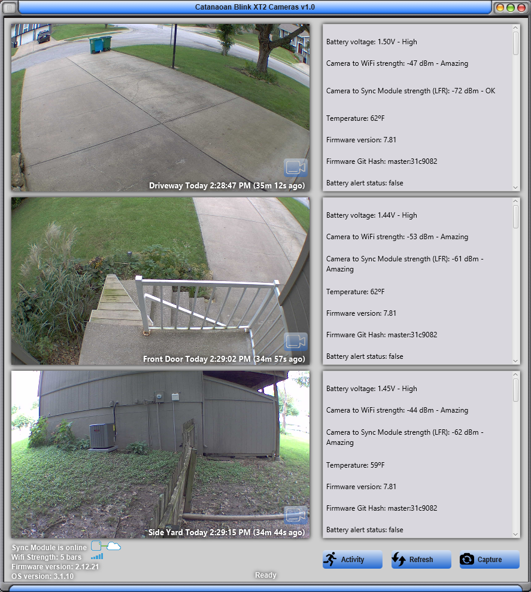

# Cloyd Blink XT2 Camera Windows Viewer
I wrote and developed this software to monitor our home while at work. [Click this link for the Android version](https://github.com/ccatanaoan/HomeTempHumidityMonitor).

This tool exposes all Blink XT2 Camera's internal information and metadata that are not visible in the official Android mobile application, as well as the video clips and thumbnails.

### Windows screenshots:

