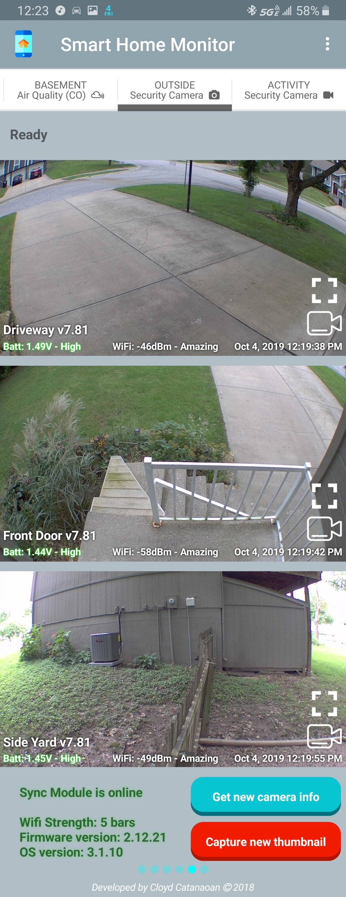
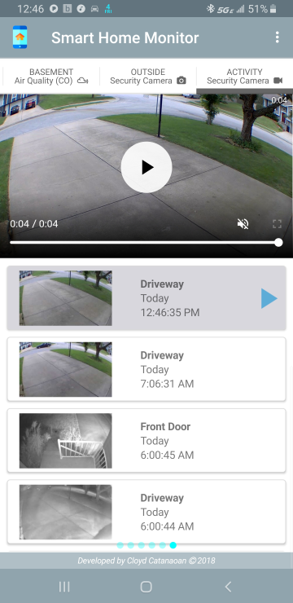
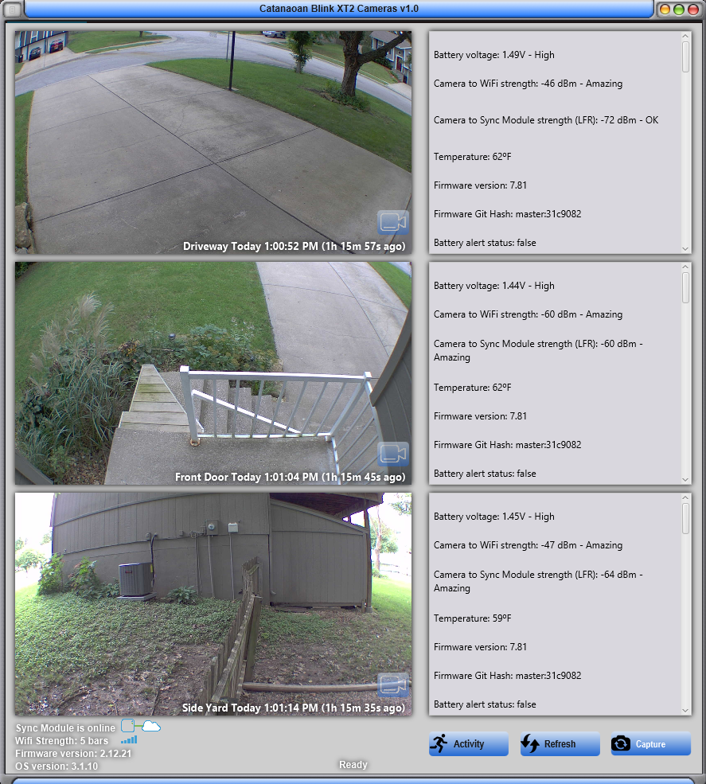
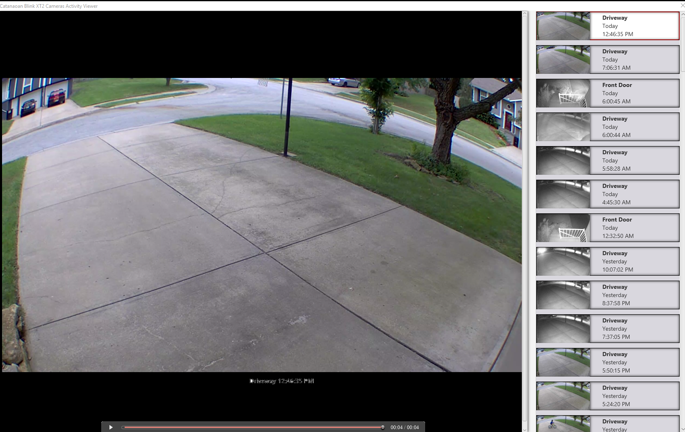

# Cloyd Blink XT2 Camera Windows Desktop Viewer
I developed this software to monitor our home using Blink XT2 cameras while I am on any computer and away from home. If I am on the move I use the Android version, which I baked in to my Smart Home Monitor custom application. [Click this link for the Android version](https://github.com/ccatanaoan/HomeTempHumidityMonitor). 

There are currently no Windows or web-based client for Blink cameras. Amazon will probably not support it nor officially release its API. This project is my way to get around this awesome camera system's limitation.

This tool exposes all Blink XT2 Camera's internal information, state, and metadata that are not in the official Android/Apple mobile application e.g. battery level in volts, WiFi signal strength, and LFR signal strength etc. 

### What it can do
- Show all historical video clips 
- Request and view new thumbnails
- Trigger a new video clip anytime even during the dreaded "System is busy, please wait" state
- Download video clips and most recent thumbnails
- Notify if the network and/or cameras are not armed
- Notify if the battery level is critical
- Show camera's state
- Show Sync Module's state

I wrote this using standard REST API, JSON, and HTTPS protocols.

### Android screenshots:

Main Blink Tab | Clip Roll
--------|------
  |  
    

### Windows screenshots:

